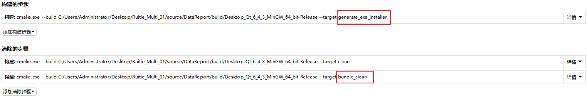
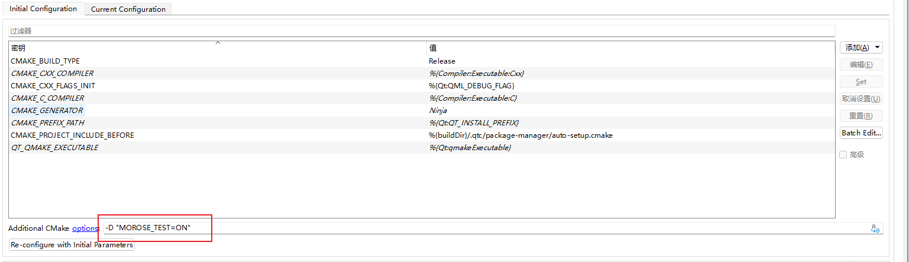

### 0. 克隆本仓库

``` powershell
git clone <git-repository> --recursive
```

### 1. 安装Chocolatey

> `Chocolatey` 用于安装`git`和`InnoSetup`
>
> 项目使用`git describe`作为版本号
>
> `InnoSetup`用于打包生成exe安装程序

```powershell
Set-ExecutionPolicy Bypass -Scope Process -Force; [System.Net.ServicePointManager]::SecurityProtocol = [System.Net.ServicePointManager]::SecurityProtocol -bor 3072; iex ((New-Object System.Net.WebClient).DownloadString('https://community.chocolatey.org/install.ps1'))
```

### 2. 安装依赖包

``` powershell
choco install packages.config
```

### 3. 添加构建和清除步骤

> **如果不需要打包生成exe安装程序，可不添加**



### 4. 添加测试

> qml加载前执行`Morose::test()`



### 程序传入参数

> -h

```powershell
Usage: <可执行程序路径> [options]
DataReport

Options:
  -?, -h, --help                     Displays help on commandline options.
  --help-all                         Displays help including Qt specific
                                     options.
  -v, --version                      Displays version information.
  --discovery <discoveryFile>        发现缺陷记录表的文件路径	(默认值为: discoveryRecord.bin).
  --inspection <inspectionFile>      探伤记录表的文件路径	(默认值为: inspectionRecord.bin)).
  --daily <dailyFile>                日常性能检查记录表的文件路径	(默认值为: dailyRecord.bin).
  --quarterlyRecord <quarterlyFile>  季度性能检查记录表的文件路径	(默认值为: quarterlyRecord.bin)
```

